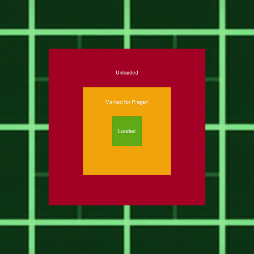

# Voxy World Gen V2



Background chunk pre-generation for [Voxy](https://modrinth.com/mod/voxy). Generates chunks silently in the background and auto-ingests them into Voxy's LOD system — no need to manually fly around.


> **Works best with:**
> 🧊 [Voxy — NeoForge Port](https://github.com/realBritakee/voxy-neoforge) — custom Voxy build for 1.20.1/1.21.1 with Physics Mod + ShaderLoader fixes · [other versions](https://modrinth.com/mod/voxy)
> 🎨 [Photon Shaders — Reimagined](https://github.com/realBritakee/photon) — custom Photon fork with Physics Mod ocean support

## Features

- Fast background chunk generation with automatic Voxy ingestion
- Configurable generation speed and queue size
- TPS-aware throttling — backs off automatically when server is under load
- Tellus integration for terrain sampling
- Server-side support with multiplayer chunk streaming
- `/voxygen` commands for runtime control
- Colored chat feedback: gold `Voxygen |` prefix, green for success, red for errors
- Smart state detection — warns if generation is already running/stopped
- Generation starts **paused** by default — requires `/voxygen start` (configurable via `autoStartOnLoad`)
- F3 debug overlay showing generation stats, rate, ETA
- HUD auto-enables on `/voxygen start`, auto-hides on `/voxygen stop`
- HUD hidden by default when generation is paused (on world load)

## Commands

| Command | Description |
|---------|-------------|
| `/voxygen start` | Resume background generation (enables HUD) |
| `/voxygen stop` | Pause background generation (hides HUD) |
| `/voxygen status` | Show current status (PAUSED/RUNNING/THROTTLED), active tasks, remaining chunks |
| `/voxygen hud` | Toggle the F3 debug overlay independently |

> Requires OP level 2.

## HUD

Open F3 to see generation stats in the bottom-right corner: status, chunks completed, skipped, remaining, active tasks, rate (chunks/sec), and ETA. The HUD automatically shows/hides with generation start/stop, or can be toggled manually with `/voxygen hud`.

## Configuration

Config file: `config/voxyworldgenv2.json`

| Option | Default | Description |
|--------|---------|-------------|
| `enabled` | `true` | Enable/disable the mod |
| `autoStartOnLoad` | `false` | Auto-start generation on world load (if `false`, requires `/voxygen start`) |
| `showF3MenuStats` | `true` | Show generation stats in the F3 debug overlay |
| `generationRadius` | `128` | Chunk radius for background generation |
| `maxQueueSize` | `20000` | Maximum chunks queued for generation |
| `maxActiveTasks` | `20` | Maximum concurrent generation tasks |

## Dependencies

- **Minecraft**: 1.20.1
- **Fabric Loader**: >= 0.18.4
- **Java**: 17+
- **Fabric API**
- **Cloth Config**: >= 11.1.136
- **Voxy**: compatible release for 1.20.1

## Building

```bash
git clone <repo>
./gradlew build
```

Artifacts are output to `build/libs/`.

## Changelog

See [CHANGELOG.md](CHANGELOG.md) for a full list of changes.

## License

CUSTOM, refer to LICENSE file for more information.

---

## Related Projects

### Voxy (LoD mod)
The Voxy LoD rendering mod this addon is built for.

- **1.20.1 / 1.21.1** → [github.com/realBritakee/voxy-neoforge](https://github.com/realBritakee/voxy-neoforge) *(custom NeoForge port with Physics Mod + ShaderLoader fixes)*
- **Other versions** → [modrinth.com/mod/voxy](https://modrinth.com/mod/voxy) *(official)*

### Photon Shaders — Reimagined
Custom Photon fork with native Physics Mod ocean support — fully compatible with Voxy World Gen V2.

- **All versions** → [github.com/realBritakee/photon](https://github.com/realBritakee/photon) *(always up to date)*
